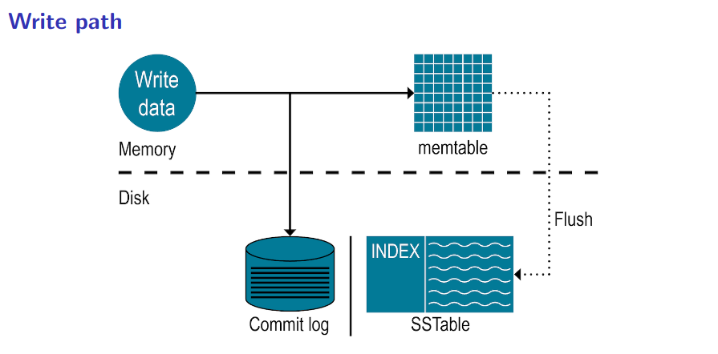
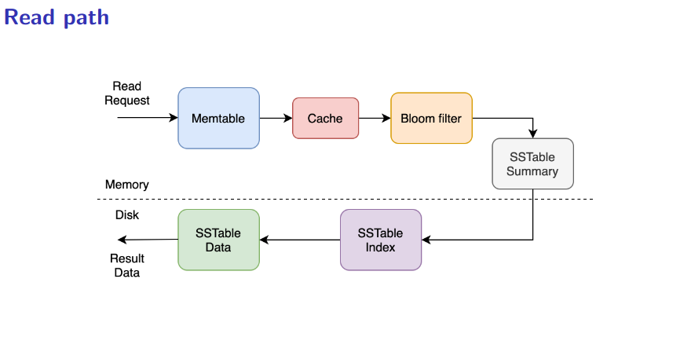

# Key-Value storage engine

## Description
Fast key-value storage library with console interface. Written in Go language using advanced
data structures, is designed to be able to process huge amount of incoming streaming and batch data efficiently.

**Data structures** used in this project: Write Ahead Log, Skip list, memtable, SStable along with 
Index and Summary tables, Merkle tree, LRU cache, Bloom Filter,
HyperLogLog, Count-min Sketch

## Features

### Scans

#### Prefix-scan
- Prefix-scan is a feature that allows you to get all the keys that start with a certain prefix.
- It is implemented using the Skip list data structure.

#### Range-scan
- Range-scan is a feature that allows you to get all the keys that are in a certain range.
- It is implemented using the Skip list data structure.
- The range-scan is inclusive, meaning that the start and end keys are included in the result.
### Iterators
### Prefix-iterator
- Prefix-iterator is a feature that allows you to iterate over all the keys that start with a certain prefix.
- It is implemented using the Skip list data structure.
- The iterator is implemented using the Iterator design pattern.

### Range-iterator
- Range-iterator is a feature that allows you to iterate over all the keys that are in a certain range.
- It is implemented using the Skip list data structure.
- The range-iterator is inclusive, meaning that the start and end keys are included in the result.